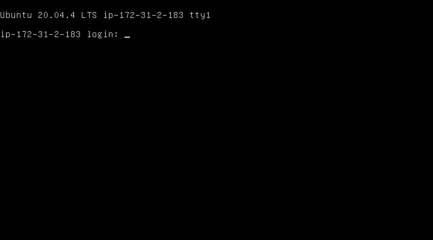

# [winSCP] 네트워크 오류 - 접속시간 초과
> AWS EC2, winSCP  

> 해결방법 요약은 하단에 위치

오랜만에 ec2로 만들어둔 인스턴스를 사용하기 위해 기존에 등록해둔 키를 통해 winSCP로 접속하려고 했다.  

여지껏 오류없이 호스트에 잘 로그인 되었었는데 5초 남짓 걸리던 로그인 시간이 너무 오래 걸려 왜이러나 싶더니 접속 시간이 초과되었다는 네트워크 오류를 뱉었다.  

단순히 접속시간의 문제인가 싶다가, 저번의 우분투 내의 네트워크 이슈가 생각나 ip주소로 ping부터 찍어보았다.

  

확실히 단순하게 WinSCP환경설정에서 접속시간 제한을 늘린다고 해결될 문제는 아닌듯.. 

인스턴스 설정에 들어가서 포트 번호를 다시 확인해보았는데 포트 설정이 21로 되어있길래 다시 22번 포트로 변경해보고 핑을 찍었는데도 만료 메시지가 떴다.  

구글을 뒤져보다가 얼핏 저번에 보안그룹 설정을 만졌던 기억이 나서 보안그룹 규칙을 확인해보니 저번에 집에서 설정했던 ip로 내 ip로만 접속 가능하도록 제한을 걸어뒀었다. 

따라서 해당 보안규칙의 소스를 '내 ip >> anywhere IPV4'로 변경해주고 winSCP 호스트 로그인을 다시 시도해보니 예전처럼 수월하게 접속되었다.

## 추가 오류
다음 날 작업을 이어하려 winSCP 호스트 로그인을 시도하니 같은 에러 발생..  

어제 해당 문제 해결했던 카페에서 작업하는거라 보안그룹문제는 아닐터라 단순 연결된 네트워크가 불안정해서 그런가 싶어 개인 핫스팟으로 변경 후 이 변경사항을 EC2보안그룹 인바운드 규칙에 업데이트해주고 다시 시도했으나 실패  

몇시간 구글 붙잡고 있어도 모르겠던 터라 EC2 인스턴스 페이지에 접속해서 이거 저거 살펴봤다.  
문제 있는 인스턴스 요약의 '상태 검사' 탭이 1/2 검사 통과로 '인스턴스 연결성 검사'가 실패한 것을 확인할 수 있었다. (사진은 문제 해결 된 후라 2/2로 되어있음)

로컬로 방화벽 설정하고 별거 다했는데 EC2 문제였구나 싶어 허탈했지만 일단 문제를 해결해보자.  
말썽인 인스턴스를 선택하면 '작업 > 모니터링 및 문제해결 > 인스턴스 스크린샷 가져오기' 탭이 있다. 이걸 클릭해주기.

  

엥 접속은 정상적으로 이루어졌던걸 확인할 수 있다.  

추가로 로그까지 확인해봤는데 딱히 에러 메시지가 떠있는게 없었다.  
그래서 그냥 인스턴스 내부의 문제구나 ~~아마존 탓이구나~~ 하고 재부팅해버렸다.  

(한번도 꺼본적 없어서 과금걱정에 과금관련 문서 싹 뒤져보고 재부팅함-탄력적 ip관련으로 인스턴스 종료후 과금되었다는 이야기가 많았는데, 내가 이해한 바로는 종료하고 탄력적 ip를 놀게 내버려두는 경우는 과금이되나, 내 경우는 재부팅하는거라 상관없다고 한다. 다시 말해, 탄력적 ip를 해제하지않고 그대로 연결한 상태로 재부팅 버튼만 누르면 됨)

그랬더니 문제가 말끔히 해결됐다.  상태검사도 2/2로 모두 성공하고, winSCP도 호스트 로그인 잘 됨
추가로 찾아보니 EC2가 가끔 과부하 등으로 이런다고 한다. 

## 요약
- 문제: winSCP 접속 안됨 - 네트워크 오류: 접속시간 초과
- 해결  
    1) AWS EC2의 해당 인스턴스 외부 접속 포트 확인  
    2) AWS EC2 해당 인스턴스 > 보안 탭 > 인바운드 보안 규칙 > 보안 규칙 수정하기 > 해당 포트의 소스 확인 후 변경 (내 ip >> anywhere IPV4)
    3) 재부팅 <<본질적 해결