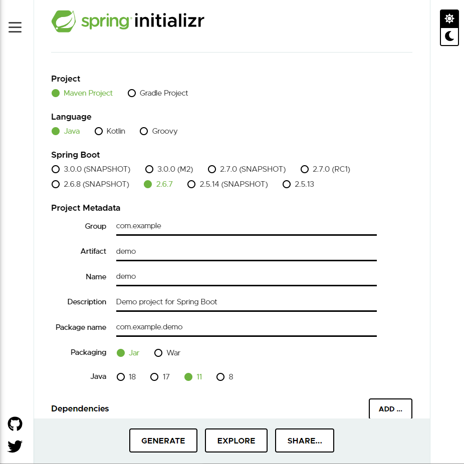
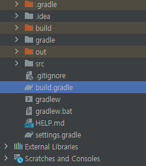
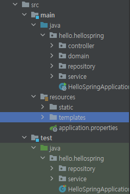

# [Spring] Spring01 - 프로젝트 폴더 구조
스프링 공부를 시작했는데 뜬구름 잡는 것 같고 공부를 해도 배운게 없는 기분에 아주아주 기초 중의 기초부터 다시 시작하려고 한다.

우선 나는 [spring initializr]:(https://start.spring.io/)를 이용하여 프로젝트를 생성하였다.  



프로젝트 빌드툴로 maven, gradle이 있는데, 요새는 다들 gradle을 사용하는 추세라고 해서 Gradle을 선택,   
언어는 Java, spring boot 버전은 정식 버전 중 (영어 안붙어 있는 것) 최신의 것을 선택했다.  
dependencies로 포함할 라이브러리로는 thymeleaf(html 만드는 템플릿 엔진), spring web(웹을 만드는데 필수 요소들 포함, 내장 톰캣 탑재)을 추가해주었다.  

지금 initializr를 사용해 프로젝트를 생성했는데, 이 정보는 추후에 프로젝트 폴더 내의 build.gradle에서 다시 확인할 수 있다.

```
//build.gradle

plugins {
	id 'org.springframework.boot' version '2.6.7'
	id 'io.spring.dependency-management' version '1.0.11.RELEASE'
	id 'java'
}

group = 'hello'
version = '0.0.1-SNAPSHOT'
sourceCompatibility = '11'

repositories {
	mavenCentral()
}

dependencies {
	implementation 'org.springframework.boot:spring-boot-starter-thymeleaf'
	implementation 'org.springframework.boot:spring-boot-starter-web'
	testImplementation 'org.springframework.boot:spring-boot-starter-test'
}

tasks.named('test') {
	useJUnitPlatform()
}
```

  

initializr로 generate한 후의 프로젝트 구조는 대략 이렇다.



그 중에서도 src 폴더를 루트로 들여다보자.  

1. src/main/java
자바(.java)파일들이 모여있는 곳.
역할별로 패키지 단위로 분리하여 클래스를 생성해 사용한다.  스프링에서 MVC 패턴의 서블릿 구조를 잡아주므로 별도 서블릿 생성 없이 사용하면 된다.  
- 서블릿(Servlet): Java를 사용해 웹페이지를 동적으로 생성하는 프로그램, 웹 통신에서 요청과 응답을 처리하는 자바 객체  
>쉽게 말해 자바 웹 서버로 웹 페이지를 제공할 때 동적인 데이터를 편하게 제공토록 하는 도구 

2. src/main/resources  
위의 java 폴더에서 사용하는 리소스들을 모아두는 곳. (설정파일, 쿼리 디렉토리)

3. src/test/java & src/test/resources
테스트시 사용하는 디렉토리

4. build.gradle  
dependencies(라이브러리 의존성) 설정.  
나는 maven의 pom.xml과 같은 역할을 한다고 받아들였다. pom.xml처럼 라이브러리 패키지명과 버전을 여기에 지정해 자동으로 다운로드 받는다. 라이브러리 간 버전 충돌도 자동으로 관리해준다고 한다.

+ gradlew: 리눅스, 맥OS용 실행 .sh 파일
+ gradlew.bat: 윈도우용 실행 배치 .sh 파일
+ gradle-wrapper.jar: jar형식으로 압축된 wrapper 파일. gradelew, gradlew.bat이 해당 파일을 통해 gradle task를 실행한다.
+ gradle-wrapper.properties: gradle wrapper 설정 파일
+ settings.gradle: 프로젝트의 구성 정보 파일  

gradle이 더 궁금하면: 출처[https://limdevbasic.tistory.com/12]:(https://limdevbasic.tistory.com/12)

5. src (~)  
웹애플리케이션(웹에서 사용하는) 자원이 담겨있는 디렉토리. jsp, js, css, xml 파일 등이 존재한다.